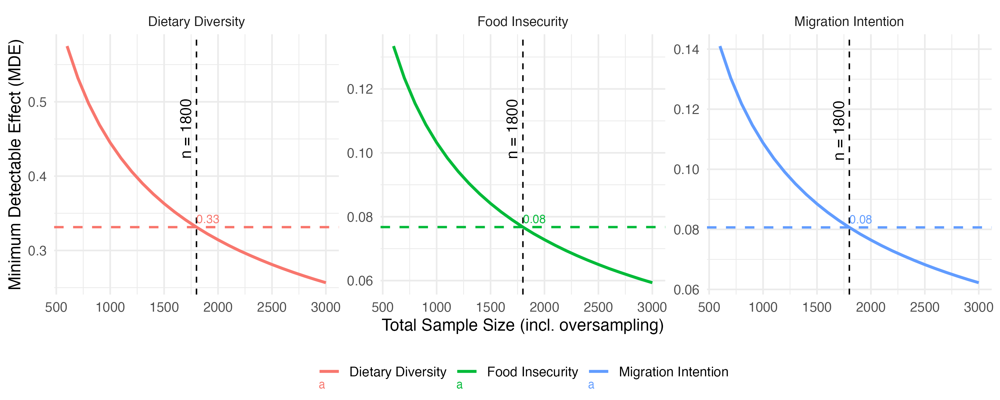

# The complex links between food security, migration, and fragility and violence in Northern Central America 
[](https://cran.r-project.org/) 
[](LICENSE) 
[](https://github.com/jcmunozmora/wb_migration_centralamerica/commits/main)

This the code repository for the project "The complex links between food security, migration, and fragility and violence in Northern Central America". The World Bank, with support from the State and Peacebuilding Fund (SPF), is undertaking an analytical study to explore the intricate links between food security, migration, and fragility in NCA. This study aims to generate robust data and insights for regional and country-specific strategies. 

---

## Table of Contents

- [Overview](#overview)
- [Repository Structure](#repository-structure)
- [Sampling Strategy - Theory](#sampling-strategy---theory)
  - [Fixed‑Sample‑Size → Minimum Detectable Effect](#fixed-sample-size--minimum-detectable-effect)
    - [Binary Outcome](#binary-outcome)
    - [Continuous Outcome (Dietary‑diversity Score)](#continuous-outcome-dietary-diversity-score)
  - [Clustering and Design Effect](#clustering-and-design-effect)
    - [Design Effect (DEFF)](#design-effect-deff)
    - [Accounting for Survey Weights](#accounting-for-survey-weights)
- [Incorporation of Fragility and Gender Strata](#incorporation-of-fragility-and-gender-strata)
  - [Gender Stratum](#gender-stratum)
  - [Fragility‑Typology Stratum](#fragility-typology-stratum)
    - [Conflict Exposure](#conflict-exposure)
    - [Climate‑risk Exposure](#climate-risk-exposure)
    - [Defined Typologies](#defined-typologies)
- [Sampling Design – Results](#sampling-design--results)
  - [Baseline Values](#baseline-values)
  - [Table 1. Baseline Values and Data Sources for Sampling Design](#table-1-baseline-values-and-data-sources-for-sampling-design)
  - [Table 2. Explanatory Power of Covariates](#table-2-explanatory-power-of-covariates)
  - [Sample Size and Simulation Details](#sample-size-and-simulation-details)
- [Visualization and Optimal Design Selection](#visualization-and-optimal-design-selection)
  - [03a_Sampling_Optimal_Clusters_analitica.r](#03a_sampling_optimal_clusters_analitica)
  - [Scatter Plot and Labeling](#scatter-plot-and-labeling)
- [Authors](#authors)
- [Appendix / Supplementary Material](#appendix--supplementary-material)

---

## Repository Structure

```text
repo/
├── code/
│   └── R/
│       ├── 01_Sample_Size_MDE.r         # Sample size calculations, MDE simulations, and power analysis for binary and continuous outcomes
│       ├── 03_Sampling_Optimal_Clusters.r # Simulations for optimal clustering design to balance statistical power and logistical feasibility
│       ├── 04_randomize_municipalities.R  # Random selection of municipalities by typology, including stratified sampling based on fragility and gender
│       └── test.r                        # Auxiliary scripts and tests
├── data/
│   ├── inputs/                         # Raw input data (e.g., shapefiles, baseline rates, ICC priors, covariate R²)
│   └── derived/                        # Processed datasets, simulation outputs, and selected sample lists
├── img/                                # Generated figures, maps, and visualizations (e.g., WB_MDE_vs_N.png)
├── docs/                               # Documentation, supplementary materials, and additional project reports
└── README.md                           # Overview of the project, methodology, and repository contents  
```
---

## Sampling Strategy - Theory

The survey follows a **multi‑stage, probability‑proportional‑to‑size (PPS) design** with *villages* as primary sampling units (PSUs) and *households* as ultimate sampling units (USUs). Stratification combines four **fragility typologies** (defined by conflict and climate‑risk scores) with **household‑head gender**, guaranteeing both geographical coverage and statistical power for key sub‑groups such as female‑headed households.

## Fixed‑Sample‑Size → Minimum Detectable Effect

Operational constraints often limit the total number of households that can be interviewed. Rather than fixing a minimum detectable effect (MDE) first, we invert the problem:

> **Given a feasible total sample size $N_{\text{total}}$, what is the *smallest effect* (MDE) that can be detected with 80 % power at $\alpha = 0.05$ once oversampling, covariate adjustment, and clustering are taken into account?**

The script **`code/R/power_reverse.R`** automates this conversion:

1. **Remove inflation factors**

   $$
   n_{\text{eff}} = \frac{N_{\text{total}}}{\bigl(1+\text{oversample}\bigr)\,\text{DEFF}_{\text{cluster}}} \times (1-R^{2}),
   $$

   producing the *effective* per‑group size expected by the `pwr` package.

2. **Solve for the effect size.**

   - Binary outcomes – root‑find on Cohen’s *h* with `pwr.2p.test()`, then convert back to an absolute risk difference.
   - Continuous outcome – root‑find on Cohen’s *d* with `pwr.t.test()`, then multiply by the outcome’s standard deviation.

3. **Return an MDE grid** for a range of candidate $N_{\text{total}}$ values (default: 800 – 5 000 households).

The figure `img/WB_MDE_vs_N.png` visualises how detectable effects shrink as the total sample size grows.

### `01_Sample_Size_MDE.r` – what the script does

`01_Sample_Size_MDE.r` takes a *grid of candidate total sample sizes*, applies the oversampling, clustering, and covariate‑adjustment factors in reverse, and then solves the power equations to obtain the **minimum detectable effect (MDE)** for each outcome.

* **Outputs**
  * `img/WB_MDE_vs_N.png` – a visual map of how the MDE declines as the total sample size increases.
  * `data/derived/mde_grid.csv` – a tidy table listing `Outcome`, `N_total`, and the corresponding `MDE`.

These artefacts guide the final choice of total households and cluster configuration without prescribing any particular effect size ex‑ante. The sample-size calculation is based on the following equation for the two **food-insecurity** and **migration** outcomes (binary outcomes).

### Binary outcome

$$
n = \bigl(Z_{\alpha/2}+Z_{\beta}\bigr)^2
    \frac{p_{1}(1-p_{1}) + p_{2}(1-p_{2})}{(p_{2}-p_{1})^{2}}
    \times \frac{1}{1-R^{2}}.
$$

* **n** – required sample size per study arm  
* $Z_{\alpha/2}=1.96$ (95 % confidence)  
* $Z_{\beta}=0.84$ (80 % power)  
* $p_{2}=p_{1}+\text{MDE}$  
* $R^{2}$ – share of outcome variance explained by covariates

### Continuous outcome (dietary‑diversity score)

$$
n = \frac{2\bigl(Z_{\alpha/2}+Z_{\beta}\bigr)^{2}\,\sigma^{2}}{\text{MDE}^{2}}
    \times \frac{1}{1-R^{2}},
$$

with residual variance $\sigma^{2}_{z}=\sigma^{2}(1-R^{2})$.

### Clustering and design effect

Because households are sampled in villages, statistical efficiency depends on the **intra‑cluster correlation** (ICC). The number of households per village cluster must be set to minimise ICC effects, balancing the número of clusters versus households per cluster.

A key concept in this process is the **Design Effect (DEFF)**, measuring the loss of efficiency due to clustering.

#### Design Effect (DEFF)

For a single‑stage cluster sample with roughly equal cluster sizes, the design effect is:

$$
\text{DEFF}_{\text{cluster}} = 1 + (m-1)\,\rho,
$$

or

$$
\text{DEFF}_{\text{cluster}} = 1 + (\bar m-1)\,\rho(1+\text{CV}_{m}^{2})
$$

for unequal clusters.

* $m$ – average households per cluster  
* $\rho$ – ICC

##### Accounting for survey weights

If sampling weights are applied, the overall design effect is:

$$
\text{DEFF}_{\text{total}} = \text{DEFF}_{\text{cluster}}\bigl(1+\text{CV}_{w}^{2}\bigr),
$$

where $\text{CV}_{w}$ is the coefficient of variation of the final weights.

---

## Incorporation of Fragility and Gender Strata

To ensure the sample design reflects the complexity of the population, the stratification incorporates two key dimensions—**gender** and **fragility**.  
The prevalence of each typology in the population was used to determine stratum proportions, guaranteeing sufficient representation to detect meaningful differences across groups.

### 1. Gender Stratum  
Within each fragility typology, the sample is further stratified by household gender type, distinguishing between **female-headed** and **male-headed** households. Sample sizes are adjusted so that gender‑specific subgroups are adequately represented.

### 2. Fragility‑Typology Stratum  
The primary stratum defines **four fragility categories** based on **climate risk** and **conflict** levels.

#### Conflict exposure  
*Indicators:* number of battles, protests, riots, acts of violence against civilians, and fatalities. A PCA is run on these variables, using the median as a cut-off. Departments above the median are classified as **high‑risk**; below, as **low‑risk**.

#### Climate‑risk exposure  
*Indicators:* water stress, probability of droughts affecting crops and livestock. Similar median‑based PCA classifies departments as **high‑risk** or **low‑risk**.

Based on both PCAs, four typologies are defined:

* **Higher Climate Risk & Conflict‑Affected**  
* **Higher Climate Risk & Non‑Conflict‑Affected**  
* **Lower Climate Risk & Conflict‑Affected**  
* **Lower Climate Risk & Non‑Conflict‑Affected**


---

## Sampling design -- Results

### Baseline values

[Descripción de los valores base utilizadas en el diseño...]

### Table 1. Baseline Values and Data Sources for Sampling Design

| **Type** | **Variable / Dimension** | **Notes / Source** | **Value<br>(× 100 %)** |
|----------|-------------------------|--------------------|------------------------|
| **Outcome** | Proportion of households reporting migration intention *(binary)* | Several studies examine the desire to migrate; the most recent regional report excludes Nicaragua. — *International Organization for Migration (IOM), 2022* | **0.35** |
| **Outcome** | Proportion of households reporting food insecurity *(binary)* | Literature reports different prevalence rates.<br>Reference values used in this estimation:<br>&nbsp;&nbsp;• Guatemala – 41 % (Deza & Ruiz-Arranz, 2022)<br>&nbsp;&nbsp;• Honduras – 39 % (Deza & Ruiz-Arranz, 2022)<br>&nbsp;&nbsp;• El Salvador – 52 % (Deza & Ruiz-Arranz, 2022)<br>&nbsp;&nbsp;• Dry Corridor (GT, HN, SV) – 43 % (WFP, 2017) | **0.41** *(average)* |
| **Outcome** | Average dietary-diversity score *(continuous)* | No systematic regional study. Evidence links food insecurity with low dietary diversity.<br>Reference: mean score = **5.6** in eight Latin-American countries (Argentina, Brazil, Chile, Colombia, Costa Rica, Ecuador, Peru, Venezuela) — *Gómez et al., 2019* | **5.0** *(average)* |
| **Stratum** | Proportion of female-headed households | Estimates suggest **30 – 40 %** of households in Central America are female-headed. | **0.35** |
| **Stratum** | Proportion of households living in fragile **Type I** areas – high climate risk **and** high conflict-affected levels | — | **0.38** |
| **Stratum** | Proportion of households living in fragile **Type II** areas – high climate risk and **high** conflict-affected levels | Own calculation based on **LandScan Global Population Database (2024)** | **0.11** |
| **Stratum** | Proportion of households living in fragile **Type III** areas – low climate risk **and** high conflict-affected levels | — | **0.40** |
| **Stratum** | Proportion of households living in fragile **Type IV** areas – low climate risk **and** low conflict-affected levels | — | **0.11** |

Given numerous unobservable factors, the sampling design integrates existing evidence on the explanatory power of key covariates for the selected outcome variables. To achieve this, relevant literature and studies were reviewed to identify the contributions of household-level and geographical covariates to the outcomes of interest. These covariates typically include household head characteristics, such as age, gender, education, employment status, and regional and community-level fixed effects. Incorporating these controls enhances the sampling design by addressing potential confounding variables, thereby ensuring that the model's explanatory power is robust and reflective of the diverse contexts within Northern Central America. The table below provides a summary of these considerations.

Once the sampling size is defined, the following decision is the composition of the number of villages and households. The optimal number of villages in the sampling design is determined by balancing statistical power and logistical feasibility. To achieve this, the design minimizes the design effect—a factor that reduces the effective sample size due to intra-cluster correlation (ICC). The trade-off lies between the number of clusters and the number of households per cluster: fewer clusters with more households increase ICC effects, reducing statistical efficiency, while more clusters with fewer households mitigate these effects but increase logistical complexity and costs. The optimal cluster size is reached when the effective sample size is maximized, and the benefits of adding more clusters begin to show diminishing returns. Practical considerations, such as field costs, accessibility of villages, and survey feasibility, further refine this balance. Simulations based on the study's parameters help identify this optimal point, ensuring robust statistical inference and operational efficiency. In most studies with moderate ICC (e.g., 0.05–0.15), the number of households per cluster typically ranges between 10 and 20, with the total number of clusters adjusted based on the overall sample size and stratification requirements.

### Table 2. Explanatory Power of Covariates (Assumptions for Dependent Variables)

| **Dependent variable** | **Common covariates** | **Notes / Source** | **\(R^{2}\)** |
|------------------------|-----------------------|--------------------|--------------|
| The proportion of households with members expressing intentions to migrate *(binary outcome)* | Individual characteristics (age, gender, education, income); household characteristics (household size, assets, access to credit); community characteristics (infrastructure, employment opportunities); contextual factors (political conditions, conflict, natural disasters) | Falco & Rotondi (2016) studied the relationship between radical Islam and willingness to migrate using a binary measure of migration intentions. Manchin & Orazbayev (2018) examined the role of social networks in shaping migration intentions across multiple countries. | **0.30** |
| In the past 30 days, did your household have enough daily food for all members? *(binary outcome)* | Household demographics (household size, dependency ratio); asset ownership; income sources; access to credit; community-level factors (infrastructure, market access) | Khandker et al. (2012) analysed the impact of seasonal migration on food insecurity in Bangladesh. Using a probit model, they reported a pseudo-\(R^{2}\) of ≈ 0.20 for household food-insecurity status. | **0.20** |
| Average dietary-diversity score *(continuous outcome)* | Household characteristics (wealth, education, access to markets); individual characteristics (age, gender); community-level factors (infrastructure, market access, night-light intensity as a proxy for economic development) | Choudhury et al. (2019) examined geographic, demographic, and infrastructural determinants of child dietary-diversity scores across 42 countries, reporting \(R^{2}\) values between 0.20 and 0.40 in linear models. | **0.30** |


### Sample size

A simulation strategy explored how sample size requirements vary with different effect sizes across these strata. By varying the MDE thresholds for each outcome, the simulation estimated the sample sizes needed to achieve sufficient power under different scenarios. The simulation results were stratified by fragility typology, gender, and ethnicity, demonstrating the trade-offs between effect size, sample size, and statistical power.

| **Parameter** | **Specification** |
|---------------|-------------------|
| **Outcome variables** | 1. **Food security** (binary)<br>2. **Migration intention** (binary)<br>3. **Dietary‑diversity score** (continuous) |
| **Significance level** (\(\alpha\)) | **0.05** (95 % confidence) |
| **Statistical power** (1 – \(\beta\)) | **80 %** |
| **Oversampling rate** | **10 %** |
| **Primary / secondary sampling units (strata)** | **4 fragility levels** &nbsp;+&nbsp; **gender** |
| **Cluster (primary sampling unit)** | **Villages** |
| **Ultimate sampling units** | **Households** |


The simulation results were visualized to show how sample size changes with MDE values for each outcome. These visualizations included separate lines for fragility, gender, and ethnic strata to illustrate how representation and power are maintained across diverse subgroups. This approach ensures that the final sampling design is comprehensive and inclusive, capturing the realities and challenges of distinct population groups in Northern Central America. A simulation strategy explored how sample size requirements change with different effect sizes across strata, including fragility typologies, gender, and ethnic groups. This simulation uses varying MDE values reflecting different hypothesized effect sizes to estimate the sample size needed to achieve sufficient power under each scenario. The simulation results were visualized to illustrate the relationship between effect size and sample size for each outcome variable, enabling a clear understanding of the sample.


| **Parameter** | **Specification** |
|---------------|-------------------|
| **Outcome variables** | 1. **Food security** (binary)<br>2. **Migration intention** (binary)<br>3. **Dietary‑diversity score** (continuous) |
| **Significance level** (\(\alpha\)) | **0.05** (95 % confidence) |
| **Statistical power** (1 – \(\beta\)) | **80 %** |
| **Oversampling rate** | **10 %** |
| **Cluster (primary sampling unit)** | **Villages** |
| **Ultimate sampling units** | **Households** |

The simulation results were visualized to show how sample size changes with MDE values for each outcome.



We conclude that an optimal sample size will be **1800** households for the four typologies are defined:

* **Higher Climate Risk & Conflict‑Affected**: 527
* **Higher Climate Risk & Non‑Conflict‑Affected**: 353 
* **Lower Climate Risk & Conflict‑Affected**: 536
* **Lower Climate Risk & Non‑Conflict‑Affected**: 384

This code is implemented using the [01_Sample_Size_MDE.r](code/R/01_Sample_Size_MDE.r). This script calculates the Minimum Detectable Effect (MDE) for both binary and continuous outcomes, using power analysis methods. It also visualizes the relationship between total sample size and MDE, and provides example calculations and population distribution by stratification. The workflow is divided into several key steps:

### 1. Libraries and Helper Functions
- **Libraries:**  
  The script loads essential R packages such as:
  - `pwr` for power and sample size calculations.
  - `dplyr` for data wrangling.
  - `ggplot2` for visualization.
  - `readxl` for importing external data.
  
- **Helper Functions:**  
  - `h2mde(h, p1)`: Converts Cohen’s h (effect size) into a difference in proportions, representing the MDE.
  - `mde2h(mde, p1)`: Inverts the process by converting an MDE into Cohen’s h.

- **Main Calculation Functions:**  
  - `binary_mde(...)`:  
    Calculates the smallest MDE for a binary outcome given a total sample size (`N_total`). It:
    - Adjusts the total sample size for oversampling.
    - Converts the adjusted total into a per-group sample size.
    - Uses a root-finding procedure (via `uniroot`) to determine the value of Cohen’s h that matches the target power.
    - Converts the determined Cohen’s h to an MDE.
    
  - `continuous_mde(...)`:  
    Calculates the smallest MDE for a continuous outcome by:
    - Adjusting the effective sample size similar to the binary case.
    - Finding Cohen’s d (standardized effect size) that meets the desired power.
    - Converting this d into an MDE on the original measurement scale by multiplying by the standard deviation.

### 2. Parameter Setup and Grid Calculation
- **Parameters:**  
  Key parameters (e.g., significance level, power target, oversampling rate) and baseline statistics (prevalences for migration intention and food insecurity, and standard deviation for dietary diversity) are defined.
  
- **Simulation Grid:**  
  A grid of candidate total sample sizes (`N_grid`) is generated (from 600 to 3000 by steps of 100).  
  For each outcome (Migration Intention, Food Insecurity, Dietary Diversity), the corresponding MDE is calculated over this grid using the appropriate function (`binary_mde` or `continuous_mde`) and the results are stored in a data frame (`out`).

### 3. Exporting the Results
- The resulting data frame `out` (which includes total sample size, outcome labels, and computed MDEs) is exported as a CSV file for further analysis.

### 4. Visualization
- **Plotting MDE vs. Total Sample Size:**  
  A `ggplot2` visualization is created to display the relationship between the total sample size (`N_total`) and the MDE:
  - A line plot shows how MDE changes with varying sample sizes.
  - A vertical dashed line is drawn at a selected sample size (`n_sample`, e.g., 1800).
  - For each outcome, an annotation is added at the center of the MDE distribution (using the median MDE) to label the chosen sample size.
  - A dashed horizontal line and text annotation display the MDE corresponding to `n_sample` for each outcome.
  - The plot is faceted by Outcome, allowing a separate panel for each, and then saved as a PNG file.

### 5. Additional Analysis
- **Population Distribution by Stratum:**  
  The script reads an external Excel file containing population data (using `readxl`), groups the data by a categorical variable (`cat_2`), and calculates the proportion as well as the expected number of households for each stratum, relative to the selected sample size.

- **Example Calculation:**  
  Finally, it demonstrates an example of what MDE values would be if the survey were conducted with exactly `n_sample` households for each outcome.

This end-to-end process enables researchers to both simulate and visualize the interplay between sample size and the detectability of effect sizes, aiding in the efficient design of surveys.

---

## Sampling selection 

[03a_Sampling_Optimal_Clusters_analitica.r](code/R/03a_Sampling_Optimal_Clusters_analitica.r) script simulates and evaluates various cluster sampling designs to find the optimal configuration under conservative assumptions. It balances statistical power and logistical feasibility by considering factors such as the number of households per cluster (`m`), intra-cluster correlation (`icc`), and the minimum detectable effect (MDE), while ensuring that the design remains within a preset budget.

### Key Components

1. **Parameter Setup**
   - **Design Parameters:**  
     The script defines grids for:
     - `m_grid`: A sequence for the number of households per cluster (e.g., 10 to 15).
     - `icc_grid`: Pre-specified values for intra-cluster correlation (e.g., 0.03, 0.05, 0.06).
     - `mde_grid`: Candidate MDE (minimum detectable effect) values (e.g., 0.10, 0.12, 0.15).
   - **Global Settings:**  
     - `alpha` is set to 0.05.
     - `pow_target` (target power) is 0.80.
     - `budget_limit` is defined (in this example, 1900 interviews maximum).
     - `p0` is the baseline prevalence (set to 0.40).
   - **Stratum Targets:**  
     The script reads data from an Excel file (`variables_A3.xls`) and computes population weights by stratum. These weights are then used to derive stratum-specific targets (total sample sizes) that may differ across groups such as _high_conflict_, _low_conflict_, _high_non_conflict_, and _low_non_conflict_.

2. **Power Calculation Function**
   - The function `power_clu()` is defined to calculate the statistical power for a given design. It:
     - Computes the effect size using the difference between a baseline prevalence (`p0`) and an alternative prevalence (adjusted by `mde`).
     - Adjusts for clustering by calculating a design effect (`deff`).
     - Uses these components to compute an estimated power via a normal approximation.

3. **Simulation (Grid Search)**
   - The script generates a grid of possible design configurations using `expand_grid()` over `m_grid`, `icc_grid`, and `mde_grid`.
   - For each stratum (using the `targets` vector), it iteratively increases the number of clusters (`k`) until the design achieves at least the target power or the design exceeds the budget.
   - The simulation results are combined into a data frame (`results`) that contains:
     - `n_design`: The total sample size (calculated as `k` × `m`).
     - The achieved `power` for each configuration.
     - A boolean flag (`within_budget`) indicating whether the design meets the budget constraint.
     - The corresponding `Stratum` label.

4. **Optimal Design Extraction**
   - From the grid results, the script extracts the optimal design for each stratum (`opt_designs`) — the design with the smallest total sample size that satisfies both power (≥ 0.80) and budget constraints.

5. **Visualization**
   - **Scatter Plot:**  
     The script creates a scatter plot (with `ggplot2`) that visualizes the relationship between the total sample size (`n_design`) and power. Key features include:
     - A horizontal line at the target power (`pow_target`) and a vertical line at the budget limit.
     - Points showing the simulated designs, colored based on whether they are within the budget.
     - Optimal designs (from `opt_designs`) are annotated with a text label showing the final number of interviews (`n_design`) along with the values of `k` (number of clusters) and `m` (households per cluster).
     - The plot is facetted by `Stratum` to display designs for different population groups.
   - **Saving the Plot:**  
     The final plot is saved as a PNG file (`img/power_scatter_budget_ICC05_optDesigns.png`).


---

## Authors

- **[Juan Carlos Muñoz-Mora]** – PI
- **[Laura Quintero]** 
- **[Jorge]**

For further details on contributions and acknowledgments, please refer to the `docs/` directory.


